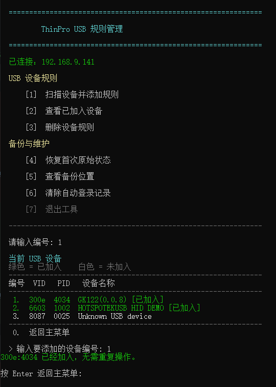

# ThinPro Horizon USB Rule Manager

[简体中文](README.md) | [English](README_EN.md)

一个用于 HP ThinPro 的 Windows 管理工具，为指定 USB 设备添加或删除 VMware Horizon USB 重定向例外规则。

项目地址：<https://github.com/tbc0309/ThinPro-Horizon-USB-Rule-Manager>

## 界面展示



## 解决什么问题

HP ThinPro 的 USB 管理器可以把设备标记为“Redirect - USBR”，但这并不保证 Horizon 一定接管设备。

Horizon 默认会排除键盘、鼠标等 HID 设备，避免用户把唯一输入设备重定向到虚拟机后无法继续操作。摄像头、麦克风等复合设备也可能受到视频、音频类别过滤和 Linux 本地驱动占用的影响。

因此可能出现以下情况：

- ThinPro USB 管理器已经勾选设备；
- Windows 虚拟机仍看不到设备；
- 点击 Horizon 的“连接”后按钮卡住，随后设备消失；
- HID、带控制键的键盘、特殊控制器或复合摄像头无法完整重定向。

本工具对用户明确选择的 VID/PID 做两项配置：

1. 在 `/etc/vmware/config` 中维护 `viewusb.IncludeVidPid`，覆盖 Horizon 的默认类别排除策略。
2. 创建精确匹配 VID/PID 的 udev 规则，让设备等待 Horizon USB 仲裁器接管。

工具不会开放全部 HID，也不会修改未选择的 USB 设备。

## 已验证环境

- HP ThinPro 7.2
- HP ThinPro 8.1.3
- VMware Horizon Client 8.0 和 8.8
- HP t630 与 HP t430
- Windows PowerShell 5.1

## 快速使用

> **重要：运行本工具前，必须先在 ThinPro 中打开“控制面板 → 可管理性 → SSHD 管理器”，勾选“启用传入安全外壳访问”，然后选择“应用”。否则工具无法通过 SSH 连接 ThinPro。**

1. 下载完整项目，保持四个运行文件位于同一目录。
2. 双击 `Start-ThinPro-USB-Rule-Manager.cmd`。
3. 输入 ThinPro IP 地址和管理员密码。
4. 核对首次显示的 SSH 主机指纹。
5. 选择“扫描设备并添加规则”。
6. 选择目标设备并确认。
7. 物理拔插设备，然后重新从 Horizon 中连接。

绿色设备表示已加入，白色设备表示尚未加入。

## 功能

- 读取 ThinPro 当前 USB 设备及名称、VID、PID。
- 选择设备并添加精确重定向规则。
- 查看或删除本工具管理的设备。
- 保存首次原始配置并提供恢复功能。
- 按 ThinPro `machine-id` 区分备份，不依赖动态 IP。
- 校验随附 `plink.exe` 的固定 SHA-256。
- 不保存 IP、管理员密码或登录记录。

## 安全设计

- SSH 固定使用 `root`，界面中称为“管理员密码”。
- 密码输入不可见，仅在本次运行中通过受限临时文件交给 Plink，退出时删除。
- 启动时清理上次异常中断遗留的工具临时密码文件。
- 首次连接或系统重装后必须人工核对 SSH SHA-256 主机指纹。
- 不要添加正在操作 ThinPro 的唯一键盘或鼠标。

## 备份与恢复

首次连接时会记录修改前状态：

```text
/etc/vmware/config.bak
/etc/udev/rules.d/98-horizon-usb-managed.rules.bak
```

如果原文件不存在，则创建 `.bak.absent` 状态标记。Windows 端还会保存一份按 `machine-id` 分类的原始副本：

```text
%LOCALAPPDATA%\ThinPro-USB-Rule-Manager\Backups\ThinPro_<machine-id>\original-backup.json
```

“恢复首次原始状态”需要输入大写 `RESTORE`，防止误操作。

## 注意事项

- USB 管理器中的 `State=2` 只表示希望重定向，不能保证覆盖 Horizon 的 HID、视频或音频排除规则。
- 网络摄像头优先考虑 Horizon RTAV。只有业务软件要求完整原生 USB 设备时，才建议使用 USBR。
- 添加或删除规则后必须物理拔插设备；必要时完全退出并重新建立 Horizon 会话。
- Windows 能看到设备但业务软件不能识别时，应继续检查 Windows 驱动和业务软件兼容性。

## 项目文件

```text
Start-ThinPro-USB-Rule-Manager.cmd  启动器
ThinPro-USB-Rule-Manager.ps1        主程序
plink.exe                           PuTTY 0.85 Plink
README_EN.md                        English documentation
使用说明.txt                         简明中文说明
docs/technical-background.md        技术原理
docs/troubleshooting.md             故障排查
THIRD_PARTY_NOTICES.md              第三方软件许可
```

## 免责声明

本工具会修改 ThinPro 的 Horizon 和 udev 配置。请先在测试设备验证，并确保现场保留可操作的键盘、鼠标或远程管理方式。
